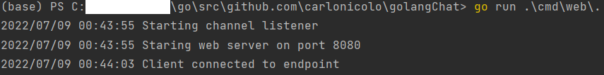

# Golang websocket chat

Simple chat in golang using websockets.

I have used PyCharm IDE for this project then you can import the project and then(if you are using Windows) in the terminal execute:   
```go run .\cmd\web\.```



This is a project illustrated in the course https://www.udemy.com/course/working-with-websockets-in-go/

